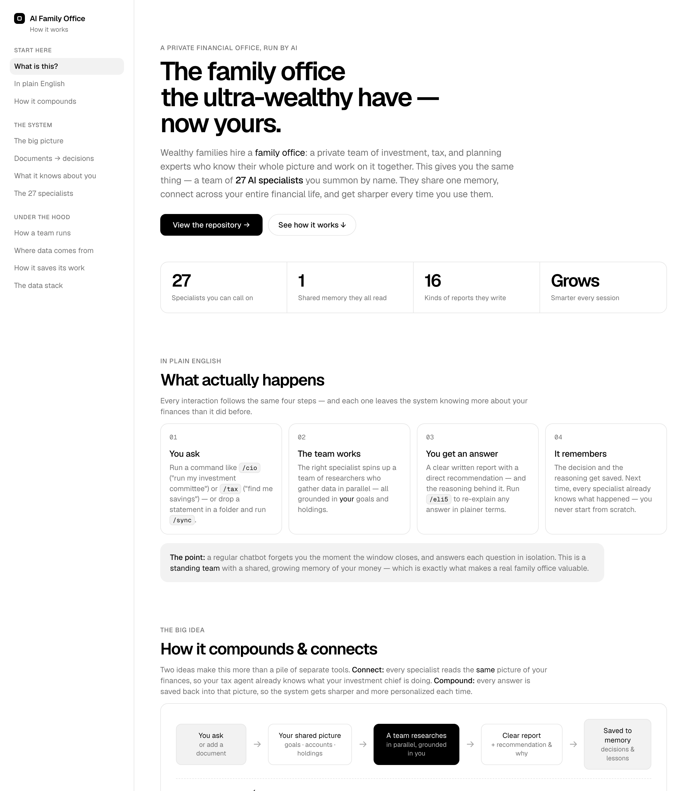

# AI-Powered Family Office

A self-hosted, open-source family office for [Claude Code](https://claude.com/claude-code) — a team of 27 specialized financial agents (CIO, equity research, macro, tax, CFO, risk, estate, and more) that manage your household's investments, money, taxes, and planning the way a traditional ultra-high-net-worth family office would. All your data stays local on your machine.

## Prerequisites

- [Claude Code](https://claude.com/claude-code) installed and authenticated
- Python 3.10+ (for the integration scripts in `scripts/`)
- Optional API keys to unlock live data (see [Data Integrations](#data-integrations)) — the agents work without them, just with less live data

## Quick Start

```bash
git clone https://github.com/elliottrjacobs/family-office.git
cd family-office
claude
```

Then, inside Claude Code:

1. **`/onboard`** — guided setup. Answer a few questions and drop any statements/exports into `imports/`. This generates the structured `profile/` data every other agent depends on.
2. **`/cio`** — convene the investment committee for a full portfolio review. Or jump straight to any agent below (e.g. `/cfo`, `/tax`, `/equity-research NVDA`).

## Customization

This repo ships **generic** — there is no personal data in it. The operating rules live in `CLAUDE.md` and each agent is defined in `.claude/skills/<name>/SKILL.md`. Adjust any of them to taste: change the report conventions, tune risk language, add or remove agents, or rewrite the tool-priority table for the APIs you actually use. Your private data only ever lives in the gitignored directories (see [Privacy](#privacy)).

## Skills

27 slash-command agents, grouped by function:

### Investment Team
| Command | Role |
|---------|------|
| `/cio` | Chief Investment Officer — orchestrates parallel research agents, sets allocation, runs the investment committee |
| `/equity-research` | Equity Research Analyst — institutional-grade single-stock analysis (5 parallel agents) |
| `/mgmt-diligence` | Management Team Diligence — scores leadership quality and character ("bet on the jockey") |
| `/lead-edge-eight` | Scores a company against an 8-criterion growth-quality rubric inspired by Lead Edge Capital founder Mitchell Green's investing framework |
| `/macro` | Macro Strategist — economic cycle, Fed, inflation, credit, geopolitics |
| `/technicals` | Technical Analyst — price action, patterns, entry/exit timing |
| `/options` | Options & Income Strategist — covered calls, puts, spreads, hedging |
| `/alts-scout` | Alternative Investments Scout — crypto, commodities, real assets |

### Sector Specialists
| Command | Role |
|---------|------|
| `/sector-tech` | Tech & AI — semiconductors, cloud/SaaS, consumer tech, cybersecurity |
| `/sector-energy` | Energy & Commodities — oil & gas, uranium/nuclear, renewables, mining |
| `/sector-finance` | Financials & Real Estate — banks, REITs, insurance, fintech |
| `/sector-biotech` | Healthcare & Biotech — pharma, biotech, medtech, FDA catalysts |

### Idea Generation & Discipline
| Command | Role |
|---------|------|
| `/screener` | Stock Screener — filters the market, then deep-dives top candidates |
| `/journal` | Trade Journal — logs decisions, tracks thesis validity, periodic reviews |

### Business
| Command | Role |
|---------|------|
| `/ventures` | Business Strategist — entity structuring, S-Corp analysis, business tax, valuation |

### Money Management
| Command | Role |
|---------|------|
| `/cfo` | Personal CFO — net worth, cash flow, budgeting, goal progress, financial health |
| `/tax` | Tax Strategist — tax-loss harvesting, Roth conversions, asset location, deductions |
| `/debt` | Debt & Credit Optimizer — payoff strategies, refinancing, invest-vs-payoff |

### Protection
| Command | Role |
|---------|------|
| `/risk` | Risk Manager — stress testing, correlation, drawdown, position sizing, IPS compliance |
| `/estate` | Estate & Asset Protection — trusts, wills, beneficiaries, insurance gaps, transfer |

### Healthcare
| Command | Role |
|---------|------|
| `/medical` | Medical & Healthcare Manager — EOB parsing, bill auditing, history, dispute advice |

### Real Estate
| Command | Role |
|---------|------|
| `/realestate` | Real Estate Analyst — deal analysis, cap rates, rent vs buy, comps |

### Market Intelligence
| Command | Role |
|---------|------|
| `/briefing` | Morning Briefing — daily market overview, news on holdings, earnings calendar |
| `/weekly-review` | Weekly Review — portfolio performance, market narrative, catalysts |

### Utility
| Command | Role |
|---------|------|
| `/eli5` | Re-explains the last agent output in plain English, no jargon |
| `/onboard` | Guided financial profile setup — **run this first** |
| `/sync` | Parses new files in `imports/`, updates profile data, flags IPS violations |

## How It Works

Prefer to *see* how it fits together rather than read it? [`family-office-system.html`](family-office-system.html) is an **interactive visual explainer** — a diagram of the agents, the data flow, and the tool stack, and how they connect and compound. *(It's an explainer of how the system works, not a screenshot of an app — there's no GUI; everything runs as slash commands inside Claude Code.)*

<p align="center">
  <a href="https://htmlpreview.github.io/?https://github.com/elliottrjacobs/family-office/blob/main/family-office-system.html">
    
  </a>
  <br/>
  <em><a href="https://htmlpreview.github.io/?https://github.com/elliottrjacobs/family-office/blob/main/family-office-system.html">📖 Open the interactive explainer →</a></em>
</p>

Each command is a skill defined in `.claude/skills/<name>/SKILL.md`. The heavier analytical agents don't think in a single pass — they **fan out into parallel sub-agents**, then synthesize. For example:

- `/cio` spawns 6 parallel research agents (Macro, Equity, Technical, Options, Risk, Alternatives) and merges their findings into one investment-committee report.
- `/equity-research` runs 5 agents (Fundamentals, Competitive, Growth, Valuation, Risk/Sentiment) on a single ticker.
- `/cfo`, `/tax`, `/risk`, `/macro`, `/medical`, `/briefing`, and `/weekly-review` each follow the same map-reduce pattern with their own specialist crews.

Every agent reads the same shared context first — your `profile/` data and the rules in `CLAUDE.md` — so they all operate from one consistent picture of your household. A small `lead-edge-researcher` sub-agent in `.claude/agents/` does focused web/API research on demand.

Two disciplines keep the data honest:
- **Source of truth.** `profile/SOURCES.md` records which file is canonical for each fact, separating *authored* data (identity, policy, goals) from *derived/live* data (positions, balances). Live financials are written only by `/sync`.
- **Drift lint.** `scripts/consistency_check.py` verifies the derived files agree with the canonical holdings and that no retired stale value has crept back in. Run it after every `/sync`.

### Data Integrations

The agents pull live data through a mandatory tool-priority stack (full reference in `profile/api-guide.md`):

- **Schwab Trader API** — a **read-only** wrapper (`scripts/schwab/client.py`) that surfaces your account positions, balances, and transactions, and is the **primary** source for stock quotes, options chains, and price history (for held *and* unheld tickers). Order placement is blocked at the wrapper layer. Run `python3.10 scripts/schwab/auth.py` to authenticate; the refresh token expires every 7 days.
- **SimpleFIN** — the easiest, **seamless** way to pull **bank & credit-card balances + transactions** into the profile, via a **read-only** wrapper (`scripts/simplefin/client.py`). Claim a setup token once (`python3.10 scripts/simplefin/auth.py`); the access URL **never expires** — no weekly re-auth (unlike Schwab) and read-only by protocol, so there's no order-placement risk. This is the recommended path for live banking data: it feeds cash-flow analysis, the budget categorizer, net-worth math, and `/debt`. `/sync` pulls it automatically and accumulates transaction history forward over time.
- **AlphaVantage** (MCP) — primary for fundamentals, ratios, earnings, transcripts, commodities, FX, and crypto; fallback for quotes/options/history.
- **SEC EDGAR** — filings (10-K/10-Q/8-K/Form 4/13F) and XBRL financials, accessed via Bash curl with a `User-Agent` header.
- **FRED** (via WebFetch) — Treasury yields, CPI, Fed funds, GDP, unemployment, mortgage rates.
- **Gemini** — `scripts/gemini/fast.py` for quick grounded "why is X" lookups, `scripts/gemini/deep_research.py` for multi-source deep research and full reports.
- **context7** (MCP) — library/framework/SDK documentation.
- **WebSearch** — last resort for structured data; first stop only for same-day breaking news.

Add your API keys to `profile/api-keys.json` (gitignored) or the corresponding environment variables. The agents degrade gracefully when a key is missing.

### Budget & expense tracking

Once bank/card data is flowing (SimpleFIN above), `/sync` runs the expense pipeline in `scripts/expenses/`:

- **`categorize.py`** applies your authored rules in `profile/expenses/categories.json` (taxonomy + descriptor/payee rules — start from `scripts/expenses/categories.example.json`) to your transactions. It splits even tricky cases — e.g. grocery-delivery by the underlying store, which lives in the bank descriptor (`IC* COSTCO BY INSTACART` → groceries vs. `DD *DOORDASH <restaurant>` → takeout) — and separates real spending from internal transfers, savings moves, and credit-card payments so the totals aren't double-counted. It writes a derived rollup (`profile/expenses/budget-data.json` + `summary.json`).
- **`build_dashboard.py`** renders a self-contained, offline `reports/budget-dashboard.html` — income-vs-spend trend, full spend-by-category breakdown, top merchants, savings-flow (contributions vs. withdrawals), and an operating-net headline.

Drop a Monarch/Mint CSV export into `imports/monarch/` to backfill years of history and bulk-seed the category map from your own past categorizations. The pipeline regenerates automatically on every `/sync`.

### Bring your own tools (swap anything)

None of these providers are sacred — the architecture is **role-based, not vendor-locked**. Each entry above fills a *role* (account data, market data, fundamentals, macro, qualitative research, web search). Swap in whatever you already pay for or prefer, or delete a row entirely and let it fall back to plain WebSearch. The only thing that matters is keeping the *priority order* explicit so agents reach for structured data before scraping the open web.

Common substitutions by role:

| Role | This repo uses | Swap in (examples) |
|------|----------------|--------------------|
| Accounts & positions | Schwab (read-only) | Interactive Brokers, E\*TRADE, Tradier, Alpaca; aggregators (SnapTrade, Plaid); or just CSV export → `/sync` |
| Bank & card data | SimpleFIN (read-only) | Plaid, MX, Teller, Finicity, GoCardless; or CSV export → `/sync` |
| Quotes / options / history | Schwab → AlphaVantage | Polygon, IEX Cloud, Tiingo, Finnhub, Yahoo Finance |
| Fundamentals | AlphaVantage → SEC EDGAR | financialmodelingprep, Sharadar, Koyfin |
| Macro / rates | FRED | BLS, World Bank, OECD, Trading Economics |
| Qualitative research / "why" / synthesis | Gemini | Perplexity, OpenAI, Anthropic, or any LLM with web access |
| Web research / source-finding / page extraction | WebSearch + WebFetch | **Exa** (`web_search_exa` / `web_fetch_exa`), Tavily, Brave Search, Firecrawl |
| Library / SDK docs | context7 | direct docs fetch, `llms.txt` |

> **Exa** is a strong drop-in for the web-research/extraction role if you add its MCP — it returns clean page content (transcripts, filings, analyst pieces) rather than just links, and supports `category:people`/`category:company` searches that are handy for management diligence.

To change a provider, edit the tool-priority table in `CLAUDE.md` and `profile/api-guide.md`, and the "research tools" instruction block inside the relevant `.claude/skills/*/SKILL.md`. Prefer the simplest setup? Remove the API rows and the system runs entirely on WebSearch — lower fidelity, zero keys.

## Privacy

Your financial life never leaves your machine. These directories are **gitignored** and hold all personal data — only `.gitkeep` placeholders are tracked so the structure ships with the repo:

```
profile/    imports/    reports/    briefings/    journal/    memory/    medical/
```

Secrets (`api-keys.json`, tokens, `.env`, `*.key`, `*.pem`) are gitignored as well. The two generic templates `profile/api-guide.md` and `profile/SOURCES.md` are the only `profile/` files tracked — they contain no personal data. Before publishing a fork, double-check `git status` and run `scripts/consistency_check.py`.

## Automation (optional)

You can schedule a daily briefing or weekly review with `cron` (Linux) or `launchd` (macOS). Example cron entry that runs the morning briefing on weekdays at 7:00am:

```cron
0 7 * * 1-5 cd /path/to/family-office && claude -p "/briefing" >> briefings/cron.log 2>&1
```

Remember the Schwab refresh token expires every 7 days — schedule a weekly reminder to run `python3.10 scripts/schwab/auth.py`, and run `python3.10 scripts/consistency_check.py` alongside it.

## License

[MIT](LICENSE). This is an AI research and analysis tool — it does not execute trades, manage real accounts, or provide licensed financial advice. All output is informational and educational; you make all final decisions. Always consult qualified professionals for tax, legal, and investment matters.
